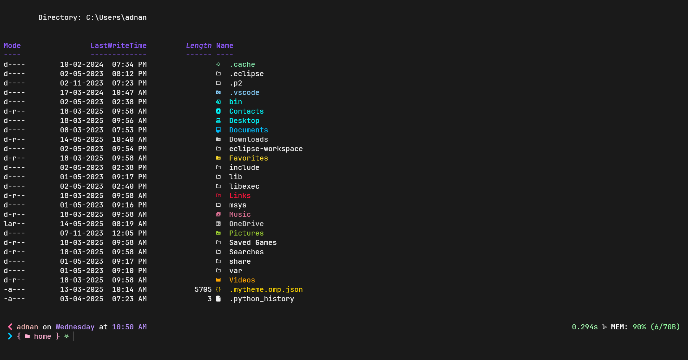

# My Windows terminal setup using oh-my-posh 

i am using oh-my-posh, nerd font and a icon pack to give my powershell a nice look!

in oder to achieve this look ypu have following thing 

1. powershell (i use powershell core)
2. A nerd font 
3. A icon pack 

## What are we going to obtain 

---
### 1. Setup the terminal
i use powershell core here. download it from microsoft store 

if you want to change the position in the drop down you can do in settings =>JSON file, and change the order under list 

### 2. Download a nerd font
for better glyph and look i would recommend download a nerd font 

i use JetBrainMono from <https://www.nerdfonts.com/> and add to your terminal default font 

### 3. Download oh-my-posh
download oh-my-posh using 

`winget install JanDeDobbeleer.OhMyPosh -s winget` 

here JanDeDobbeleer is a theme . You can see lot more in <https://ohmyposh.dev/docs/themes>

i use a theme called 1_shell

you can run it using `oh-my-posh.exe` in terminal

 Go to the  poweshell $PROFILE and edit the omp-profileconfig.ps1 file for invoke 
. So the `oh-my-posh.exe` will run automatically 
